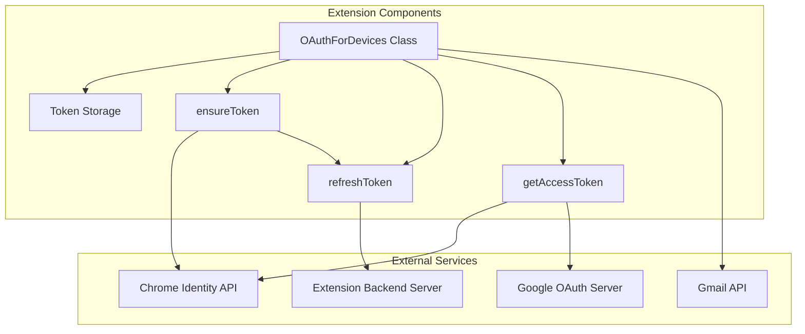
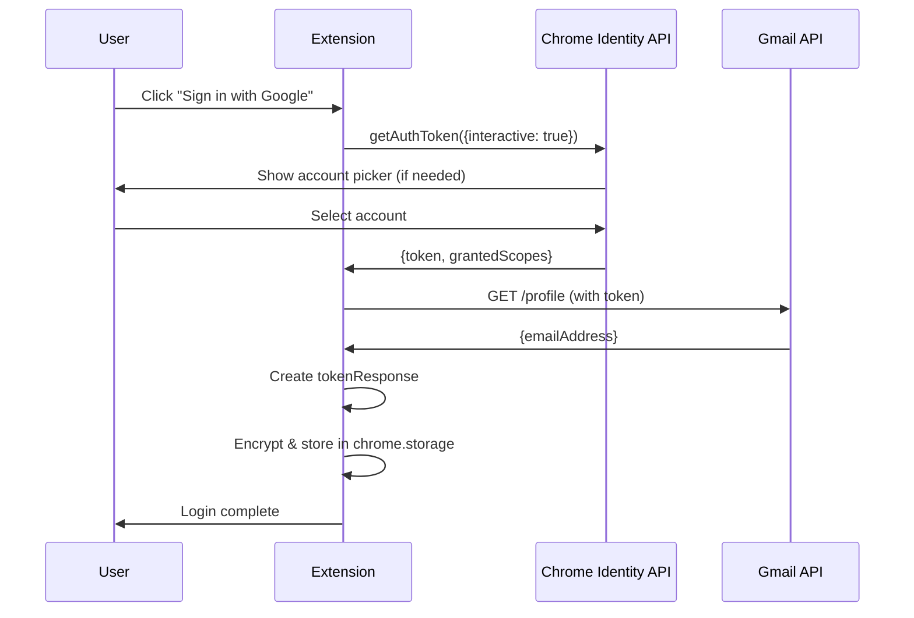
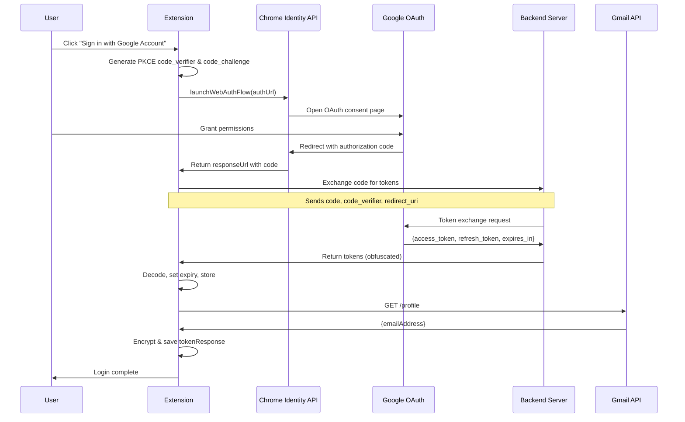
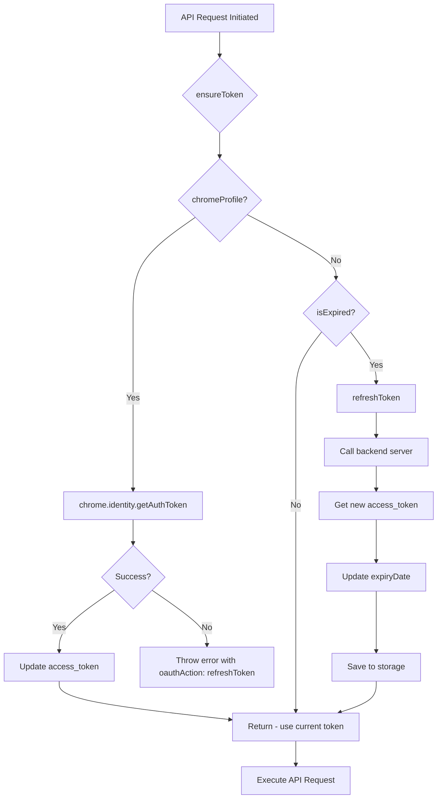
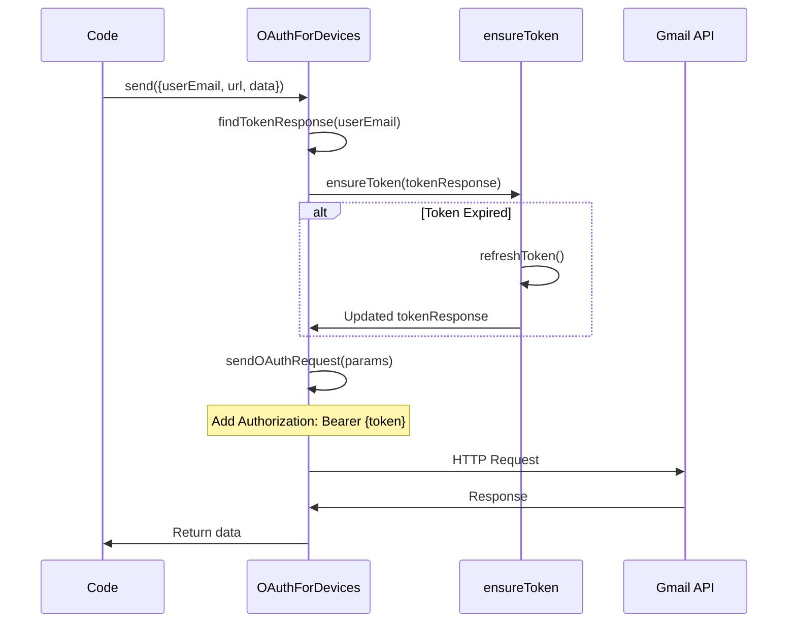

# Checker Plus for Gmail - OAuth Authentication Technical Guide

## Complete Workflow for Persistent Google Connection

This document provides a detailed technical analysis of how Checker Plus for Gmail maintains a permanent connection to Google after initial login, ensuring users never need to re-authenticate unless they explicitly revoke access.

---

## Table of Contents

1. [Architecture Overview](#architecture-overview)
2. [Token Types & Structure](#token-types--structure)
3. [Initial Authentication Flow](#initial-authentication-flow)
4. [Token Persistence & Storage](#token-persistence--storage)
5. [Automatic Token Refresh](#automatic-token-refresh)
6. [API Request Flow](#api-request-flow)
7. [Error Handling & Recovery](#error-handling--recovery)
8. [Key Code References](#key-code-references)

---

## Architecture Overview

The extension uses a **dual OAuth strategy** that supports two authentication methods:

| Method | Use Case | Key Characteristics |
|--------|----------|---------------------|
| **Chrome Profile Sign-In** | Uses browser's built-in Google account | No refresh token needed; Chrome handles refresh internally |
| **Google Accounts Web Flow** | Manual sign-in with any Google account | Uses refresh tokens; extension manages refresh |

### Core Components



---

## Token Types & Structure

### TokenResponse Object Structure

```javascript
// Stored in chrome.storage (encrypted)
{
    // Core tokens
    "access_token": "ya29.xxx...",        // Short-lived (1 hour)
    "refresh_token": "1//xxx...",          // Long-lived (never expires)
    
    // Metadata
    "token_type": "Bearer",
    "expires_in": 3600,                    // Seconds (1 hour)
    "expiryDate": "2026-01-18T13:00:00Z",  // Calculated expiry timestamp
    
    // Account info
    "userEmail": "user@gmail.com",
    "name": "User Name",
    "photoUrl": "https://...",
    
    // OAuth type flags
    "chromeProfile": true,                 // OR
    "launchWebAuthFlow": true,             // One of these is true
    
    // Client identification
    "clientId": "450788627700-xxx...",
    
    // Granted permissions
    "scopes": [
        "https://www.googleapis.com/auth/gmail.modify"
    ]
}
```

### Storage Keys

| Key | Purpose |
|-----|---------|
| `tokenResponsesEmails` | Gmail API tokens |
| `tokenResponsesContacts` | People/Contacts API tokens |
| `tokenResponsesProfiles` | User profile tokens |

---

## Initial Authentication Flow

### Method 1: Chrome Profile Sign-In



**Key Code** ([common.js:3581-3601](file:///c:/Users/Shovon%20Ahmed/Documents/Checker%20plus%20raw%20code/33.2.3_0/common.js#L3581-L3601)):

```javascript
// Chrome Profile Sign-In
tokenResponse = {
    chromeProfile: true,
    clientId: chrome.runtime.getManifest().oauth2.client_id
};

const getAuthTokenParams = {
    interactive: true,
    scopes: params.scopes || defaultParams.scopes
};

authResponse = await chrome.identity.getAuthToken(getAuthTokenParams);
tokenResponse.access_token = authResponse.token;
```

---

### Method 2: Google Accounts Web Flow (Manual Sign-In)



**Key Code** ([common.js:3496-3563](file:///c:/Users/Shovon%20Ahmed/Documents/Checker%20plus%20raw%20code/33.2.3_0/common.js#L3496-L3563)):

```javascript
// PKCE Challenge Generation
const generateCodeVerifier = () => {
    const array = new Uint8Array(56);
    crypto.getRandomValues(array);
    return base64UrlEncode(array);
};

const generateCodeChallenge = async (codeVerifier) => {
    const encoder = new TextEncoder();
    const data = encoder.encode(codeVerifier);
    const digest = await crypto.subtle.digest('SHA-256', data);
    return base64UrlEncode(new Uint8Array(digest));
};

// Build OAuth URL
const searchParams = {
    client_id: GOOGLE_WEB_APP_CLIENT_ID,
    response_type: 'code',
    redirect_uri: redirectURI,
    access_type: "offline",              // ← Required for refresh_token
    scope: params.scopes.join(' '),
    include_granted_scopes: true,
    code_challenge: codeChallenge,
    code_challenge_method: 'S256',
    prompt: "consent"                     // ← Forces refresh_token
};

// Launch OAuth flow
const responseUrl = await chrome.identity.launchWebAuthFlow({ 
    url: `${GOOGLE_AUTH_URL}?${authParams.toString()}`, 
    interactive: true 
});

// Exchange code for tokens via backend server
const data = await getAuthTokenFromServer({
    code: urLParamsObj.code,
    google_redirect_uri: redirectURI,
    code_verifier: codeVerifier,
    extension: ITEM_ID,
});
```

---

## Token Persistence & Storage

### Encryption Layer

Tokens are stored **encrypted** using the extension's `Encryption` module:

```javascript
// Saving tokens (common.js:3140)
async function setTokenResponses(tokenResponses) {
    await storage.setEncryptedObj(defaultParams.storageKey, tokenResponses);
}

// Loading tokens (common.js:3125)
this.getTokenResponses = async () => {
    const responses = await storage.getEncryptedObj(
        defaultParams.storageKey, 
        dateReviver
    ) || [];
    return responses;
}
```

**Encryption Implementation** ([common.js:5398-5410](file:///c:/Users/Shovon%20Ahmed/Documents/Checker%20plus%20raw%20code/33.2.3_0/common.js#L5398-L5410)):

```javascript
this.setEncryptedObj = async function (key, value, replacer = null) {
    const encryptedObj = await Encryption.encryptObj(value, replacer);
    return that.set(key, encryptedObj);
};

this.getEncryptedObj = async function(key, reviver = null) {
    const value = await that.get(key);
    return await Encryption.decryptObj(value, reviver);
}
```

### Storage Location

- **Primary**: IndexedDB (via Chrome extension storage API)
- **Backup**: Chrome's sync storage for cross-device sync

---

## Automatic Token Refresh

This is the **core mechanism** that keeps the extension connected forever.

### The ensureToken() Function

Called **before every API request** to guarantee a valid token:



**Implementation** ([common.js:3292-3319](file:///c:/Users/Shovon%20Ahmed/Documents/Checker%20plus%20raw%20code/33.2.3_0/common.js#L3292-L3319)):

```javascript
async function ensureToken(tokenResponse) {
    if (tokenResponse.chromeProfile) {
        // CHROME PROFILE PATH
        // Chrome internally handles token refresh
        const getAuthTokenParams = {
            interactive: false,  // Silent refresh
            scopes: tokenResponse.scopes || [Scopes.GMAIL_MODIFY]
        };
        
        try {
            const authResponse = await getAuthToken(getAuthTokenParams);
            tokenResponse.access_token = authResponse.token;
            await updateToken(tokenResponse);
            return {};
        } catch (errorMessage) {
            const error = Error(errorMessage);
            error.tokenResponse = tokenResponse;
            error.oauthAction = "refreshToken";
            
            if (error.toString().includes("OAuth2 not granted or revoked")) {
                error.code = 401;
            }
            throw error;
        }
    } else if (isExpired(tokenResponse)) {
        // WEB FLOW PATH
        // Manual refresh using refresh_token
        console.log("token expired: ", tokenResponse);
        return refreshToken(tokenResponse);
    } else {
        // Token still valid
        return {};
    }
}
```

### The isExpired() Function

Checks token validity with a **5-minute safety buffer**:

```javascript
// common.js:3356-3360
function isExpired(tokenResponse) {
    var SECONDS_BUFFER = -300; // 5 minutes BEFORE actual expiry
    return !tokenResponse.expiryDate || 
           new Date().isAfter(
               new Date(tokenResponse.expiryDate).addSeconds(SECONDS_BUFFER, true)
           );
}
```

**Timeline Visualization:**

```
Token received    Refresh triggered    Actual expiry
     |                  |                   |
     |←── 55 minutes ──→|←── 5 min buffer ─→|
     |                  |                   |
    t=0               t=55min            t=60min
```

### The refreshToken() Function

Exchanges refresh_token for a new access_token:

**Implementation** ([common.js:3321-3354](file:///c:/Users/Shovon%20Ahmed/Documents/Checker%20plus%20raw%20code/33.2.3_0/common.js#L3321-L3354)):

```javascript
async function refreshToken(tokenResponse) {
    console.log("refresh token: " + tokenResponse.userEmail);

    let data = {
        refresh_token: tokenResponse.refresh_token,
        extension: ITEM_ID,
    };

    // Handle legacy OAuth client ID
    if (!tokenResponse.clientId) {
        data.old_client_id = true;
    }

    try {
        // Call backend server to exchange refresh_token
        data = await getAuthTokenFromServer(data);
    } catch (errorMessage) {
        const error = Error(errorMessage);
        error.tokenResponse = tokenResponse;
        error.oauthAction = "refreshToken";
        throw error;
    }

    // Update token with new values
    tokenResponse.access_token = data.access_token;
    tokenResponse.token_type = data.token_type;
    tokenResponse.expires_in = data.expires_in;
    
    // Calculate new expiry date
    setExpiryDate(tokenResponse);
    
    // Save updated token to storage
    await updateToken(tokenResponse);

    return {tokenResponse: tokenResponse};
}

function setExpiryDate(tokenResponse) {
    // expires_in is in seconds
    tokenResponse.expiryDate = new Date(
        Date.now() + (tokenResponse.expires_in * 1000)
    );
}
```

### Backend Server Token Exchange

The extension uses a **proxy server** to hide the OAuth client_secret:

```javascript
// common.js:3380-3397
async function getAuthTokenFromServer(data) {
    data.version = "3";
    
    // Obfuscate refresh_token before sending
    if (data.refresh_token) {
        data.ert = eStr(data.refresh_token);  // Simple encoding
        delete data.refresh_token;
    }

    const rawResponse = await oauthFetch(Urls.OauthToken, data, {
        method: "post",
        headers: {
            "content-type": "application/json"
        },
    });
    
    // Decode response
    const response = dStr(rawResponse);
    return JSON.parse(response);
}

// Simple obfuscation (not true encryption)
function eStr(raw, offset = 1) {
    let str = "";
    for (let i = 0; i < raw.length; i++) {
        str += String.fromCharCode(raw.charCodeAt(i) + offset);
    }
    return str;
}
```

---

## API Request Flow

Every Gmail API request follows this flow:



**Implementation** ([common.js:3426-3449](file:///c:/Users/Shovon%20Ahmed/Documents/Checker%20plus%20raw%20code/33.2.3_0/common.js#L3426-L3449)):

```javascript
this.send = async function(params) {
    let tokenResponse;
    
    // Find token for this email
    if (params.tokenResponse) {
        tokenResponse = params.tokenResponse;
    } else {
        tokenResponse = await that.findTokenResponse(params.userEmail);
    }
    
    if (tokenResponse) {
        // CRITICAL: Ensure token is valid before sending request
        await ensureToken(tokenResponse);
        
        params.tokenResponse = tokenResponse;
        return sendOAuthRequest(params);
    } else {
        throw new Error(JError.NO_TOKEN_FOR_EMAIL);
    }
}

async function sendOAuthRequest(params) {
    const accessToken = params.tokenResponse.access_token;
    
    const options = {
        headers: {
            Authorization: "Bearer " + accessToken,  // ← Bearer token
        },
        method: params.type?.toUpperCase(),
        mode: "cors",
    };
    
    return await oauthFetch(params.url, params.data, options);
}
```

---

## Error Handling & Recovery

### 401 Unauthorized Handling

When a token is rejected:

```javascript
// In ensureToken for Chrome Profile flow
if (error.toString().includes("OAuth2 not granted or revoked")) {
    error.code = 401;
}

// Error propagation pattern
error.tokenResponse = tokenResponse;
error.oauthAction = "refreshToken";  // Tells UI to prompt re-auth
```

### Token Revocation Detection

```javascript
// common.js:3217-3219
if (error == "invalid_grant" || 
    error == "invalid_request" || 
    error.code == ErrorCodes.BAD_REQUEST || 
    error.code == ErrorCodes.UNAUTHORIZED) {
    error.message = "You need to re-grant access, it was probably revoked";
}
```

### Cached Token Removal

```javascript
// common.js:5590-5603
if (chrome.identity) {
    // Remove specific token from cache
    await chrome.identity.removeCachedAuthToken({ token: token });
    
    // Clear all cached tokens
    await chrome.identity.clearAllCachedAuthTokens();
}
```

---

## Key Code References

| Function | File | Lines | Purpose |
|----------|------|--------|---------|
| `OAuthForDevices` | [common.js](file:///c:/Users/Shovon%20Ahmed/Documents/Checker%20plus%20raw%20code/33.2.3_0/common.js#L3113) | 3113-3645 | Main OAuth class |
| `ensureToken` | [common.js](file:///c:/Users/Shovon%20Ahmed/Documents/Checker%20plus%20raw%20code/33.2.3_0/common.js#L3292) | 3292-3319 | Token validation & refresh |
| `refreshToken` | [common.js](file:///c:/Users/Shovon%20Ahmed/Documents/Checker%20plus%20raw%20code/33.2.3_0/common.js#L3321) | 3321-3354 | Refresh token exchange |
| `isExpired` | [common.js](file:///c:/Users/Shovon%20Ahmed/Documents/Checker%20plus%20raw%20code/33.2.3_0/common.js#L3357) | 3356-3360 | Expiry check with buffer |
| `getAccessToken` | [common.js](file:///c:/Users/Shovon%20Ahmed/Documents/Checker%20plus%20raw%20code/33.2.3_0/common.js#L3488) | 3488-3644 | Initial auth flow |
| `getAuthTokenFromServer` | [common.js](file:///c:/Users/Shovon%20Ahmed/Documents/Checker%20plus%20raw%20code/33.2.3_0/common.js#L3380) | 3380-3397 | Backend token exchange |
| `send` | [common.js](file:///c:/Users/Shovon%20Ahmed/Documents/Checker%20plus%20raw%20code/33.2.3_0/common.js#L3426) | 3426-3449 | API request with token |
| `initOauthAPIs` | [checkerPlusForGmail.js](file:///c:/Users/Shovon%20Ahmed/Documents/Checker%20plus%20raw%20code/33.2.3_0/checkerPlusForGmail.js#L2652) | 2652-2705 | OAuth instance initialization |
| `setEncryptedObj` | [common.js](file:///c:/Users/Shovon%20Ahmed/Documents/Checker%20plus%20raw%20code/33.2.3_0/common.js#L5398) | 5398-5401 | Encrypted storage |

---

## Summary: Why It "Never" Logs Out

```
┌────────────────────────────────────────────────────────────────┐
│                    THE PERSISTENCE FORMULA                      │
├────────────────────────────────────────────────────────────────┤
│                                                                 │
│  1. REFRESH TOKEN STORED                                        │
│     └─→ Encrypted in chrome.storage                            │
│     └─→ Never expires until revoked                            │
│                                                                 │
│  2. PROACTIVE REFRESH                                           │
│     └─→ ensureToken() called before EVERY API request          │
│     └─→ Refreshes 5 minutes BEFORE actual expiry               │
│                                                                 │
│  3. DUAL AUTH SUPPORT                                           │
│     └─→ Chrome Profile: Chrome handles refresh internally      │
│     └─→ Web Flow: Extension manages via backend server         │
│                                                                 │
│  4. SECURE BACKEND PROXY                                        │
│     └─→ client_secret never exposed in extension code          │
│     └─→ Token exchange happens server-side                     │
│                                                                 │
│  5. RE-AUTH ONLY WHEN:                                          │
│     └─→ User explicitly revokes access                         │
│     └─→ User changes Google password                           │
│     └─→ Token unused for 6+ months                             │
│     └─→ Google invalidates tokens (rare)                       │
│                                                                 │
└────────────────────────────────────────────────────────────────┘
```

---

*Document generated from analysis of Checker Plus for Gmail v33.2.3*
